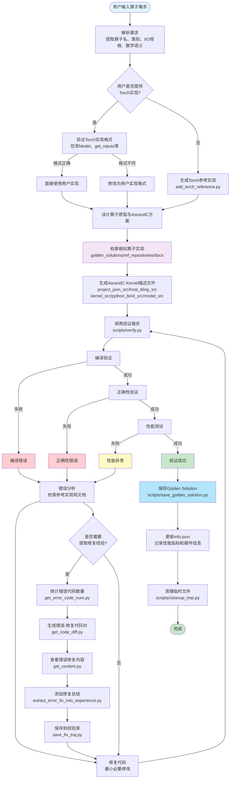

# AscendC Kernel Generator

一个用于生成、验证和持续改进 AscendC 自定义算子的技能项目。本项目基于 `multi-kernel-bench` 构建，提供了完整的算子开发、测试和优化流程。

## 📋 目录

- [项目简介](#项目简介)
- [功能特性](#功能特性)
- [项目结构](#项目结构)
- [快速开始](#快速开始)
- [工作流程](#工作流程)
- [核心组件](#核心组件)
- [使用示例](#使用示例)
- [环境配置](#环境配置)
- [贡献指南](#贡献指南)

## 🎯 项目简介

AscendC Kernel Generator 是一个智能化的 AscendC 算子生成工具，能够：

- **自动生成**：根据用户需求自动生成 AscendC 自定义算子实现
- **智能验证**：通过统一的验证接口进行编译、正确性和性能测试
- **持续学习**：将验证通过的实现保存为 golden solutions，不断积累经验
- **错误修复**：基于错误信息自动检索参考实现和文档，进行智能修复

## ✨ 功能特性

- 🔄 **端到端工作流**：从算子需求到最终实现的完整自动化流程
- 📚 **知识库管理**：维护 golden solutions 和错误修复经验库
- 🔍 **智能检索**：自动检索相似算子实现和官方文档
- ✅ **统一验证**：通过 HTTP 服务提供统一的编译、正确性和性能验证接口
- 📊 **性能分析**：提供详细的性能指标统计和分析
- 🛠️ **错误追踪**：记录错误修复轨迹，形成可复用的经验库

## 📁 项目结构

```
ascend-kernel-generator/
├── examples/                          # 示例文件
│   ├── add_torch_reference.py        # Torch 参考实现示例
│   └── add.py                        # AscendC 算子完整示例
├── scripts/                           # 核心脚本
│   ├── verify.py                     # 验证服务客户端
│   ├── save_golden_solution.py       # 保存 golden solution
│   ├── save_fix_traj.py              # 保存错误修复轨迹
│   ├── get_error_code_num.py         # 统计错误代码数量
│   ├── get_code_diff.py              # 生成错误-修复代码对
│   ├── get_content.py                # 查看错误修复内容
│   ├── extract_error_fix_into_experience.py  # 提取修复经验
│   ├── cleanup_tmp.py                # 清理临时文件
│   └── multi-kernel-bench/           # 多核基准测试框架
│       ├── envs/                     # 环境定义
│       ├── backends/                 # 后端实现
│       ├── verify_server.py          # HTTP 验证服务
│       └── ...
├── reference/                         # 参考资源
│   ├── golden_solutions/             # 已验证的算子实现
│   │   ├── add.py
│   │   ├── matmul.py
│   │   ├── gelu.py
│   │   └── info.json                 # 算子元信息
│   ├── issues/                       # 错误修复经验库
│   ├── docs/                         # 官方文档分片
│   │   ├── ascendc_dev_guide_sections/
│   │   ├── ascendc_best_practice_sections/
│   │   └── acl_interface_ref_sections/
│   └── ref_repositories/             # 开源参考仓库
│       ├── ascend-samples/
│       ├── cann-ops/
│       ├── ops-math/
│       ├── ops-nn/
│       └── ops-transformer/
├── SKILL.md                          # 技能详细文档
└── README.md                         # 本文件
```

## 🚀 快速开始

### 1. 环境准备

```bash
# 设置技能根目录（可选）
export ASCEND_SKILL_ROOT=/path/to/ascend-kernel-generator

# 设置验证服务地址（可选，默认 http://127.0.0.1:23457/verify）
export ASCEND_VERIFY_URL=http://127.0.0.1:23457/verify
```

### 2. 启动验证服务

```bash
cd scripts/multi-kernel-bench
python verify_server.py
```

### 3. 生成算子

使用技能时，提供算子需求（语义描述、Torch 伪代码或输入输出规格），系统将自动：

1. 生成 Torch 参考实现
2. 设计 AscendC 算子实现
3. 进行验证
4. 保存 golden solution（如果成功）

## 🔄 工作流程

### 完整流程图

> 💡 **提示**：更详细的流程图（包括错误修复经验提取流程、验证服务调用流程等）请查看 [WORKFLOW.md](./WORKFLOW.md)



### 主要阶段

1. **需求输入**：用户提供算子需求
2. **Torch 参考实现**：生成可执行的 PyTorch 参考实现
3. **算子设计**：设计算子原型和 AscendC 实现方案
4. **代码生成**：生成完整的 AscendC kernel 描述文件
5. **验证测试**：通过验证服务进行编译、正确性和性能测试
6. **结果处理**：
   - **成功**：保存为 golden solution
   - **失败**：错误分析和修复循环
7. **后处理**：清理临时文件

## 🧩 核心组件

### 1. 验证服务 (`scripts/verify.py`)

统一的验证接口客户端，支持：

- 编译验证
- 正确性验证
- 性能测试
- 流式日志输出

**使用示例**：

```bash
python scripts/verify.py \
  --op add \
  --reference_path examples/add_torch_reference.py \
  --kernel_code_path examples/add.py \
  --devices npu:0 \
  --stream \
  --result_json_path ./add_verify_result.json
```

### 2. Golden Solution 管理 (`scripts/save_golden_solution.py`)

将验证通过的实现保存到知识库：

```bash
python scripts/save_golden_solution.py \
  --op add \
  --result_path ./add_verify_result.json \
  --kernel_code_path ./add.py \
  --reference_path ./add_torch_reference.py
```

### 3. 错误修复经验提取

完整的错误修复经验提取流程：

```bash
# 1. 统计错误代码数量
python scripts/get_error_code_num.py --traj_path ./traj.json

# 2. 生成错误-修复代码对
python scripts/get_code_diff.py --traj_path ./traj.json --output ./error_fix_pairs.json

# 3. 查看特定错误修复内容
python scripts/get_content.py --json_path ./error_fix_pairs.json --idx 0

# 4. 添加修复总结
python scripts/extract_error_fix_into_experience.py \
  --pairs_path ./error_fix_pairs.json \
  --idx 0 \
  --summary "修复了数据类型不匹配的问题"

# 5. 保存到经验库
python scripts/save_fix_traj.py --op add --pairs_path ./error_fix_pairs.json
```

## 💡 使用示例

### 示例 1：生成简单的加法算子

1. **提供需求**：需要一个支持两个张量相加的算子

2. **系统自动生成**：
   - `add_torch_reference.py`：Torch 参考实现
   - `add.py`：AscendC 算子实现

3. **验证**：
   ```bash
   python scripts/verify.py \
     --op add \
     --reference_path add_torch_reference.py \
     --kernel_code_path add.py \
     --devices npu:0
   ```

4. **保存**（验证成功后）：
   ```bash
   python scripts/save_golden_solution.py \
     --op add \
     --result_path add_verify_result.json \
     --kernel_code_path add.py \
     --reference_path add_torch_reference.py
   ```

### 示例 2：复杂算子（如 MatMul + LeakyReLU）

系统会自动：
- 检索相似的算子实现（如 `matmul.py`、`leaky_relu.py`）
- 参考官方文档和最佳实践
- 生成融合算子实现
- 进行验证和优化

## ⚙️ 环境配置

### 必需环境变量

- `ASCEND_SKILL_ROOT`：技能安装根目录（可选，自动推断）
- `ASCEND_VERIFY_URL`：验证服务地址（可选，默认 `http://127.0.0.1:23457/verify`）

### 依赖要求

- Python 3.7+
- PyTorch
- AscendC 开发环境
- CANN 工具链

## 📝 算子实现格式

每个 AscendC 算子实现文件应包含以下全局变量：

- `project_json_src`：算子 JSON 描述
- `host_tiling_src`：Host 侧 tiling 实现
- `host_operator_src`：Host 侧算子实现
- `kernel_src`：Kernel 侧实现
- `python_bind_src`：Python 绑定代码
- `model_src`：前向模型实现

参考 `examples/add.py` 了解完整格式。

## 🔍 知识库检索

系统支持在以下位置检索参考实现：

- **Golden Solutions**：`reference/golden_solutions/*.py`
- **开源仓库**：`reference/ref_repositories/`
- **官方文档**：`reference/docs/`

使用 `rg` (ripgrep) 进行检索：

```bash
rg "AddCustom" reference -n
rg "reduce_sum" reference/ref_repositories -n
```

## 🛠️ 故障排除

### 验证服务连接失败

检查验证服务是否运行：

```bash
curl http://127.0.0.1:23457/verify
```

### 编译错误

- 检查 AscendC 环境配置
- 参考 `reference/docs/` 中的官方文档
- 查看 `reference/issues/` 中的类似错误修复经验

### 性能问题

- 检查 tiling 策略
- 参考 golden solutions 中的性能指标
- 优化 BLOCK_DIM 和 tile 配置

## 📚 相关文档

- [SKILL.md](./SKILL.md)：详细的技能使用文档
- [WORKFLOW.md](./WORKFLOW.md)：完整的工作流程图和说明
- [VERIFY_SERVICE.md](./VERIFY_SERVICE.md)：验证服务文档
- [AscendC 开发指南](https://www.hiascend.com/document)

## 🤝 贡献指南

1. Fork 本项目
2. 创建特性分支
3. 提交更改
4. 推送到分支
5. 创建 Pull Request

## 📄 许可证

请查看项目根目录的 LICENSE 文件。

## 🔗 相关链接

- [AscendC 官方文档](https://www.hiascend.com/document)
- [CANN 工具链](https://www.hiascend.com/software/cann)
- [multi-kernel-bench](https://github.com/your-repo/multi-kernel-bench)

---

**注意**：本项目是一个skills项目，主要用于在 Claude Code、Codex 或其他支持skills的平台上使用。确保正确配置环境变量和依赖项以获得最佳体验。
