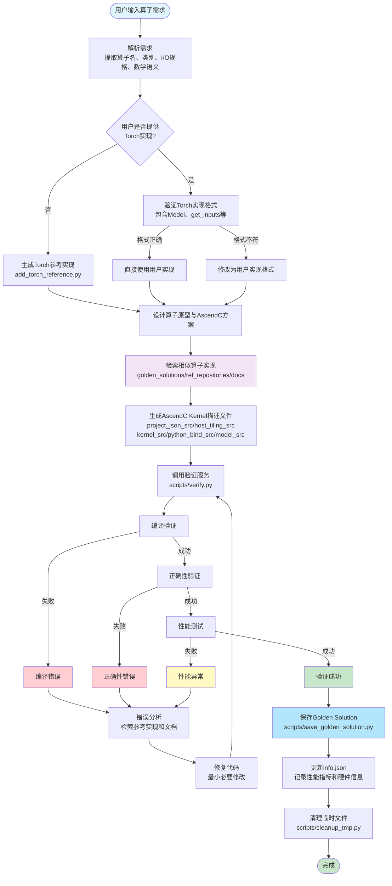
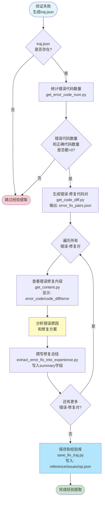
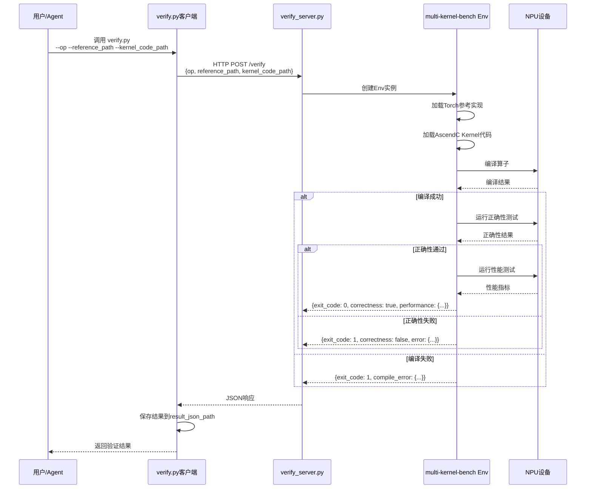
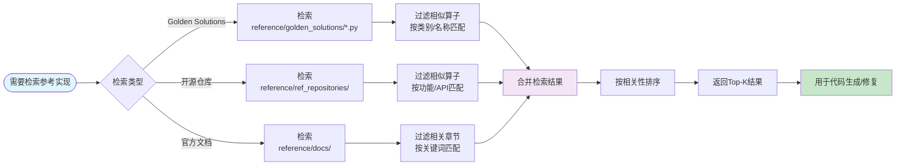
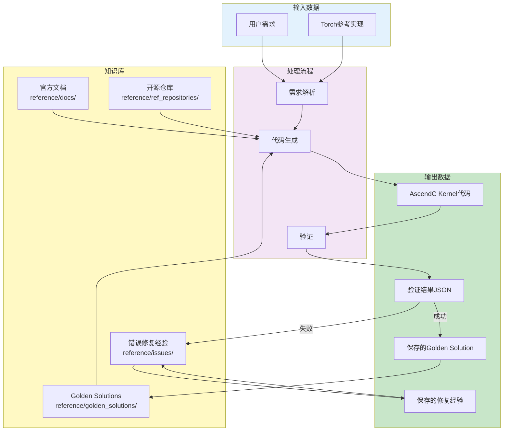

# AscendC Kernel Generator 工作流程图

本文档提供了 AscendC Kernel Generator 的详细工作流程图，包括主流程和错误处理流程。

## 主流程图

## 错误修复经验提取流程

## 验证服务调用流程

## 知识库检索流程

## 数据流图

## 阶段说明

### 阶段 1: 需求输入与解析
- 用户提供算子需求（语义描述、Torch 伪代码或输入输出规格）
- 系统解析并提取：
  - 算子名称和类别
  - 输入/输出张量规格
  - 数学语义
  - 约束条件

### 阶段 2: Torch 参考实现
- 检查用户是否提供 Torch 实现
- 如果提供，验证格式是否符合要求
- 如果未提供或格式不符，生成标准格式的 Torch 参考实现

### 阶段 3: 算子设计
- 设计算子原型（JSON 描述）
- 设计 Host 侧实现（tiling、operator）
- 设计 Kernel 侧实现
- 检索相似算子作为参考

### 阶段 4: 代码生成
- 生成完整的 AscendC Kernel 描述文件
- 包含所有必需的代码段（project_json_src、host_tiling_src 等）

### 阶段 5: 验证测试
- 编译验证
- 正确性验证
- 性能测试

### 阶段 6: 结果处理
- **成功**：保存为 Golden Solution
- **失败**：进入错误分析和修复循环

### 阶段 7: 后处理
- 清理临时文件
- 更新知识库索引
