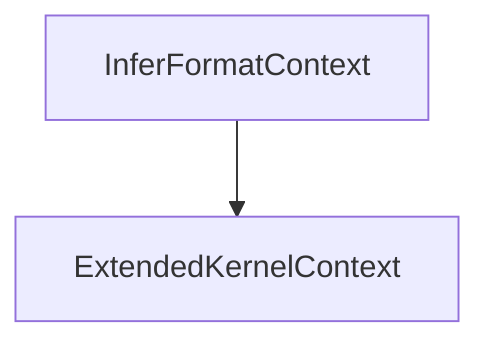

##### 简介

`InferFormatContext` 继承自 `ExtendedKernelContext`，是一个用于 Format 推导的上下文类。该类的主要作用是在推导算子输出 Format 的过程中，提供必要的输入输出 Format、输入输出 Shape 和输入 Tensor 访问接口。`InferFormatContext` 是 Format 推导函数的入参，Format 推导函数的相关解释请参考 15.2.2.18.6 InferFormat。

`InferFormatContext` 继承关系图如下：



## 需要包含的头文件

```cpp
#include <infer_format_context.h>
```

## Public 成员函数

### 输入 Format 相关

- `StorageFormat *GetInputFormat(const size_t index)`
- `StorageFormat *GetRequiredInputFormat(const size_t ir_index)`
- `StorageFormat *GetOptionalInputFormat(const size_t ir_index)`
- `StorageFormat *GetDynamicInputFormat(const size_t ir_index, const size_t relative_index)`

### 输入 Shape 相关

- `const Shape *GetInputShape(const size_t index) const`
- `const Shape *GetRequiredInputShape(const size_t ir_index) const`
- `const Shape *GetOptionalInputShape(const size_t ir_index) const`
- `const Shape *GetDynamicInputShape(const size_t ir_index, const size_t relative_index) const`

### 输入 Tensor 相关

- `const Tensor *GetInputTensor(const size_t index) const`
- `const Tensor *GetRequiredInputTensor(const size_t ir_index) const`
- `const Tensor *GetOptionalInputTensor(const size_t ir_index) const`
- `const Tensor *GetDynamicInputTensor(const size_t ir_index, const size_t relative_index) const`

### 输出 Format 相关

- `StorageFormat *GetOutputFormat(const size_t index)`
- `StorageFormat *GetRequiredOutputFormat(const size_t ir_index)`
- `StorageFormat *GetDynamicOutputFormat(const size_t ir_index, const size_t relative_index)`
