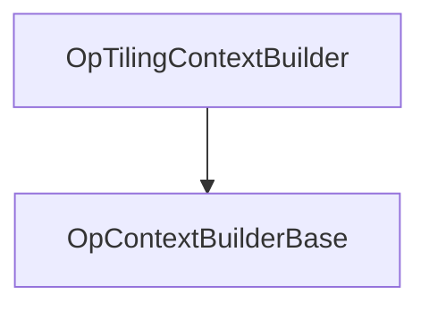

##### 简介

`OpTilingContextBuilder` 用于构建 `TilingContext`。构造出的 `Context` 在算子 Tiling 计算过程中作为入参，用于获取必要的算子输入输出等数据。Tiling 计算完成后，结果会被写回上下文中。

`OpTilingContextBuilder` 继承关系图如下：



## 使用步骤

1. **构造 ContextHolder**  
   调用 `OpTilingContextBuilder` 接口，传入相应的输入数据（如输入的 Tensor、PlatformInfo 等），最终调用 `Build()` 接口构造一个 `ContextHolder<TilingContext>` 对象。

2. **获取 TilingContext**  
   通过 `ContextHolder` 调用 `GetContext` 接口，获取 `TilingContext`。

3. **调用 Tiling 实现函数**  
   调用算子 Tiling 实现函数 `TilingKernelFunc`，将 `TilingContext` 作为函数入参，完成 Tiling 计算，算子写入计算的输出结果。

4. **获取 Tiling 计算结果**  
   通过 `TilingContext` 的接口可以获取 Tiling 计算的结果。

5. **释放 ContextHolder**  
   根据需要释放 `ContextHolder`，释放完成后，由 `Build` 构造出来的 `TilingContext` 中的数据指针均无效。

## 说明

该类继承自 `OpContextBuilderBase` 类，在 `Build` 构建 `ContextHolder` 对象之前，需要调用 `OpContextBuilderBase` 的以下接口：

- `OpType`：设置算子的类型
- `OpName`：设置算子的名称
- `IONum` 或 `IOInstanceNum`：设置输入输出个数
- `AppendAttr`：设置算子的属性

## 头文件

```cpp
#include "base/context_builder/op_tiling_context_builder.h"
```

## Public 成员函数

| 函数 | 说明 |
|------|------|
| `OpTilingContextBuilder()` | 构造函数 |
| `~OpTilingContextBuilder() override` | 析构函数 |
| `OpTilingContextBuilder &CompileInfo(const void *compile_info)` | 设置编译信息 |
| `OpTilingContextBuilder &PlatformInfo(const void *platform_info)` | 设置平台信息 |
| `OpTilingContextBuilder &Deterministic(int32_t deterministic)` | 设置确定性标志 |
| `OpTilingContextBuilder &TilingData(const gert::TilingData *tiling_data, gert::Chain::Deleter deleter = nullptr)` | 设置 Tiling 数据 |
| `OpTilingContextBuilder &TilingDataSize(size_t tiling_data_size)` | 设置 Tiling 数据大小 |
| `OpTilingContextBuilder &Workspace(const gert::ContinuousVector *workspace)` | 设置工作空间 |
| `OpTilingContextBuilder &InputTensors(const std::vector<gert::Tensor *> &inputs)` | 设置输入张量 |
| `OpTilingContextBuilder &OutputTensors(const std::vector<gert::Tensor *> &outputs)` | 设置输出张量 |
| `ContextHolder<TilingContext> Build()` | 构建 ContextHolder |
