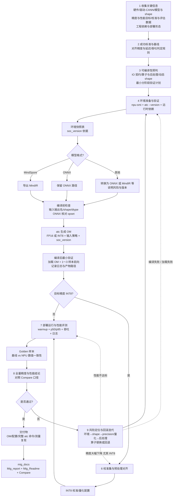

# 昇腾 NPU 迁移工作流（WorkFlow）

本文件与 [SKILL.md](SKILL.md) 中的章节顺序对齐，便于单独打开预览或分享给团队。

- **详细步骤与命令模板**：见 [SKILL.md](SKILL.md)。
- **交付文档模板**：迁移结束后维护 [mig_docs/](mig_docs/README.md) 下的 `Mig_report.md`、`Mig_Readme.md`、`Compare.md`。

---

## Workflow 图（Mermaid）

---

## 节点与 SKILL 章节对照

| 图中节点 | SKILL.md 对应 |
|----------|----------------|
| A | §1 先收集关键信息 |
| B | §2 定义成功标准与基线 |
| C | §3 可编译性预判 |
| D / DS | §4 准备环境并验证 + 环境快照表 |
| PRE / H / HV | §5 导出/编译 OM + 编译前检查 + 编译后最小验证 |
| K / L | §6 INT8 校准与量化 |
| J | §7 性能评估 |
| GD / M | §8 精度对比（含 Golden）与综合结论 |
| P | §9 风险点与回滚策略 |
| MD | `mig_docs` 规范输出 |

---

## 版本说明

- 图中 **FP16/INT8** 以实际目标为准；若先验证非量化通路，可在 `H` 阶段优先 FP16 再进入 `I`。
- `atc` 参数随 CANN 版本变化，以当前安装文档与用户 `atc --version` 为准。
